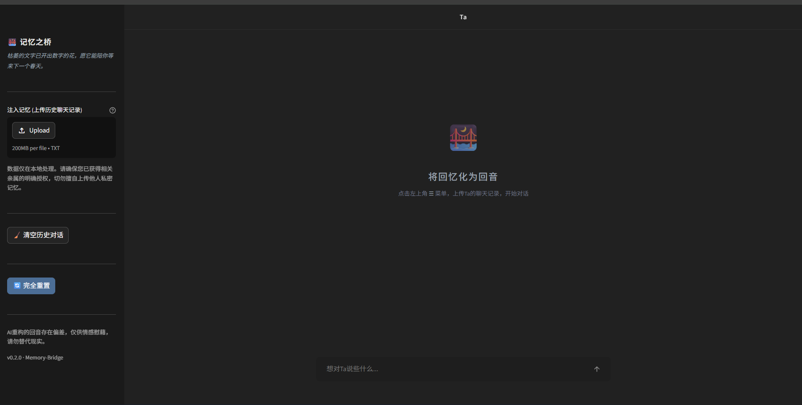
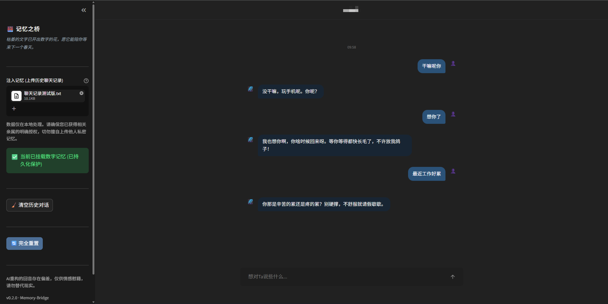
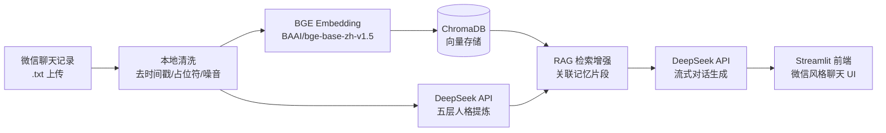

# 记忆之桥 Memory-Bridge

基于 RAG 的陪伴式 AI 系统——上传微信聊天记录，生成故人的数字回音。





## 技术架构



## 核心特性

- **RAG 检索增强** — 每次对话前从 ChromaDB 检索与当前话题最相关的 Top-3 记忆片段，注入 System Prompt 作为上下文锚点，避免 AI 凭空编造
- **五层人格提炼** — 从聊天记录中提取身份信息、核心性格、说话风格、情感模式、高频口头禅，70% 忠于原貌 + 30% 柔化处理
- **四道伦理锁** — 身份锁定（禁止角色切换）、反幻觉约束（未记载即坦白不记得）、极端情绪干预（仅轻生倾向触发现实拉回）、Late-binding System Override（末尾追加最高优先级指令抵抗越狱攻击）
- **Session 隔离多租户** — URL Query 参数 `?sid=UUID` 做 session affinity，SQLite + ChromaDB 全部按 session_id 分区，不同用户数据完全隔离
- **流式微信风格 UI** — Streamlit 流式输出 + 纯 CSS 模拟微信气泡（头像、时间戳、左右对齐），零外部前端依赖

## 项目结构

```
memory_bridge/
├── app.py              # UI 层 — main()、侧边栏、聊天渲染、弹窗组件、session 初始化
├── config.py           # 全局配置 — 路径、模型参数、正则、环境变量常量
├── db.py               # SQLite 持久化 — chat_history / system_memory 两表，WAL 模式
├── embedding.py        # ChromaDB + BGE — 文本切块、向量索引、RAG 检索
├── llm.py              # DeepSeek API — 人格提炼（非流式）、对话生成（流式）、伦理锁
└── text_processing.py  # 文本工具 — 聊天记录清洗、人名提取、时间格式化
```

## 快速开始

```bash
# 1. 克隆仓库
git clone https://github.com/TheIanLi/Memory-Bridge.git
cd Memory-Bridge

# 2. 安装依赖（Python ≥ 3.10）
pip install -r requirements.txt

# 3. 配置 API 密钥
echo "DEEPSEEK_API_KEY=sk-your-key-here" > .env

# 4. 启动（首次运行会自动下载 BGE 模型，约 400MB）
streamlit run memory_bridge/app.py
```

首次加载 BGE 模型时设置了 `HF_ENDPOINT=https://hf-mirror.com` 加速国内下载。如果走代理访问 DeepSeek API，在终端中设置 `HTTP_PROXY` 环境变量即可，客户端会自动拾取。

## 技术决策

**为什么用 SQLite 而不是 PostgreSQL？** 目标场景是个人部署、单机运行。SQLite 零运维、零配置，WAL 模式下并发读写足够用。引入 PostgreSQL 意味着用户需要额外安装数据库服务，对非技术用户不友好。

**为什么用本地 BGE 而不是 API Embedding？** 聊天记录属于高度敏感数据，不应上传到第三方服务。BGE-base-zh-v1.5 在中文语义任务上表现出色，本地推理只有 ~400MB 显存开销，个人电脑完全跑得动。同时避免了 API 调用的延迟和按量计费成本。

**为什么选 DeepSeek？** 中文理解和生成能力在同等价位模型中处于第一梯队。`deepseek-v4-flash` 响应快、支持流式输出，适合对话场景。API 兼容 OpenAI SDK，接入成本低。

## 已知局限与未来规划

**当前局限：**

| 局限项 | 说明 / 应对思路 |
|---|---|
| 仅支持微信 `.txt` 导出格式 | 格式解析层已解耦为独立模块（`text_processing.py`），新增 QQ / Telegram 等格式只需实现对应的 parser，不涉及架构改动 |
| 人格提炼质量依赖语料丰富度 | 计划在 UI 层加入最低消息数阈值校验（如 ≥ 200 条），语料不足时明确告知用户而非强行生成低质量画像 |
| 无用户认证，session 通过 URL 参数传递 | 个人单机部署场景下的刻意取舍——零配置、无 cookie banner。多用户 SaaS 场景可前置 nginx basic auth 或 OAuth2 Proxy |
| 前端依赖 Streamlit 默认样式，移动端体验一般 | Streamlit 核心定位是数据原型，非生产级前端。长期考虑 FastAPI + React 重构前端层，同时保留 Streamlit 作为快速原型入口 |
| 对话历史仅保留最近 10 轮 | 受限于 LLM context window 成本。缓解方案：对早期对话做摘要压缩后注入 system prompt，在 token 预算内拓展有效记忆跨度 |

**路线图：**

- **v0.3（近期）** — 支持 QQ / Telegram 聊天记录导入、上传文件大小与格式校验、语料最低消息数阈值提醒
- **v0.4（中期）** — 对话质量评估面板（基于 embedding 相似度的回复质量评估机制，已有雏形）、Prompt 配置界面、对话历史全文搜索
- **v1.0（远期）** — Docker 一键部署、支持多模型切换（GPT / Claude / 本地模型）、语音消息与语音回复

## License

MIT

本项目为技术探索性质，旨在验证 RAG + 人格镜像的技术可行性，仅供情感慰藉参考，不可替代专业心理咨询。
